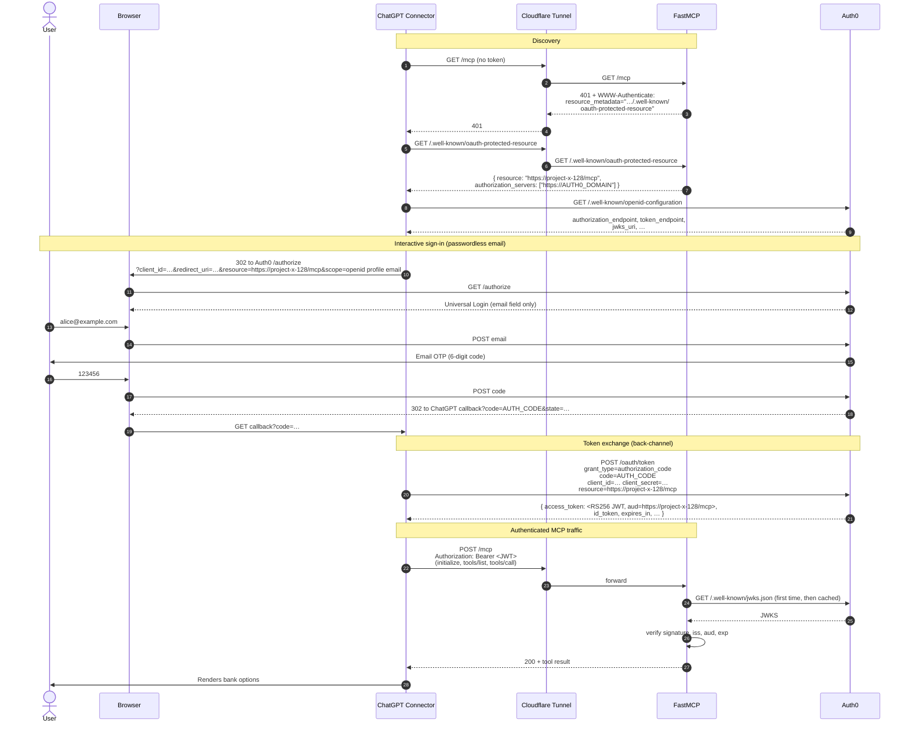
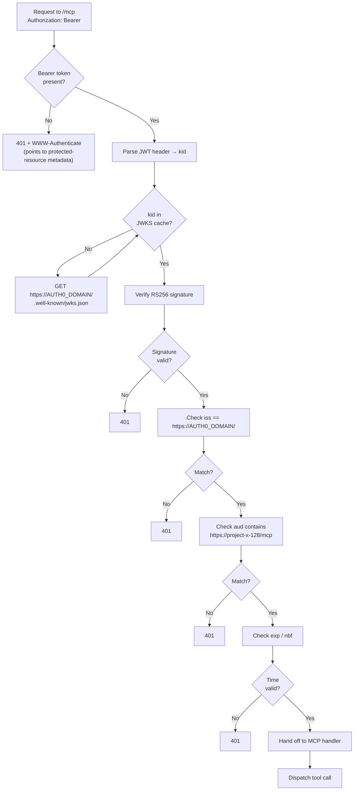

# Bank of AK — MCP Demo Architecture

A ChatGPT custom connector lets users talk to a self-hosted MCP server that exposes a "Bank of AK" (Santander UK-styled) student-account toolset. End users sign in with **passwordless email** (one-time code) via Auth0; the MCP server validates Auth0-issued JWTs on every request.

---

## 1. Components

| Layer | Component | Where it lives | Purpose |
|---|---|---|---|
| Client | **ChatGPT custom connector** | OpenAI cloud | Originates user-facing chat, speaks MCP over Streamable HTTP, performs OAuth 2.1 |
| Edge | **Cloudflare Quick Tunnel** | `*.trycloudflare.com` | Terminates HTTPS in front of the VPS (ChatGPT refuses non-HTTPS MCP URLs) |
| Compute | **FastMCP server** | Hostinger VPS `187.124.112.103:80` | Hosts the MCP tools, validates Bearer JWTs |
| Identity | **Auth0** | `dev-kjosrz7por203551.uk.auth0.com` | Authorization Server (`/authorize`, `/oauth/token`, JWKS), passwordless email connection, API resource definition |
| Browser | **End-user browser** | Local | Renders Auth0 Universal Login during the OAuth dance |

### Auth0 sub-objects

- **Application** — `Bank of AK ChatGPT Client` (Regular Web App, first-party). Holds `client_id` + `client_secret`, allowed callback URLs, and the list of *connections* and *APIs* it can talk to.
- **Connection** — `email` (Passwordless). Promoted to domain-level so the Application can enable it.
- **API** — `project-x`, identifier `https://project-x-128/mcp`. This is the *resource* (audience) the JWT will be minted for. The identifier is immutable and arbitrary — it does **not** need to match the MCP server URL.

---

## 2. High-level topology

```mermaid
flowchart LR
  subgraph Browser["User Browser"]
    UB[Browser tab]
  end
  subgraph OpenAI["ChatGPT (OpenAI cloud)"]
    Conn["Custom Connector<br/>Bank of AK"]
  end
  subgraph CF["Cloudflare edge"]
    Tunnel["Quick Tunnel<br/>employed-absent-prize-himself<br/>.trycloudflare.com"]
  end
  subgraph VPS["Hostinger VPS — 187.124.112.103"]
    cfd["cloudflared client<br/>(outbound 443 to CF)"]
    Srv["FastMCP server<br/>uvicorn :80"]
    T1["Tool: list_available_student_account_options"]
    T2["Tool: add_numbers"]
  end
  subgraph A0["Auth0 — dev-kjosrz7por203551.uk.auth0.com"]
    AS["Authorization Server<br/>/authorize, /oauth/token, jwks_uri"]
    Pwl["Connection: email (passwordless)"]
    Api["API: project-x<br/>aud=https://project-x-128/mcp"]
    App["Application: Bank of AK ChatGPT Client"]
  end

  UB <-->|HTTPS chat| Conn
  UB <-->|HTTPS Universal Login + OTP| AS
  Conn <-->|HTTPS MCP / OAuth| Tunnel
  Tunnel <--> cfd
  cfd <--> Srv
  Srv --> T1
  Srv --> T2
  Conn <-->|/authorize, /oauth/token| AS
  Srv -->|JWKS fetch (cached)| AS
  App -.->|enables| Pwl
  App -.->|authorized for| Api
```

**Trust boundaries:**

1. OpenAI ↔ Cloudflare edge — TLS, no shared secret.
2. ChatGPT ↔ Auth0 — OAuth 2.1 with `client_id` + `client_secret` (User-Defined OAuth Client).
3. Browser ↔ Auth0 — TLS to Auth0 Universal Login; user proves identity via OTP.
4. FastMCP ↔ Auth0 — read-only fetch of `jwks.json` to verify token signatures (no secret).

---

## 3. Authentication flow (end-to-end)



**Key non-obvious bits:**

- ChatGPT *requires* HTTPS for the MCP server URL → Cloudflare Tunnel.
- ChatGPT **ignores** the `resource` field from the protected-resource metadata when minting the token request, so the **Resource** override field in the custom-connector advanced settings is what actually controls the JWT audience. That field must equal `AUTH0_AUDIENCE`.
- We use a **User-Defined OAuth Client** instead of Dynamic Client Registration because Auth0 enforces PKCE on public clients, and ChatGPT's DCR path registers a public client without sending PKCE — `client_secret` lets the client be confidential and skip PKCE.
- The `resource` parameter (RFC 8707) on `/authorize` and `/oauth/token` is what tells Auth0 *which* API audience to mint the token for. Auth0's **Resource Parameter Compatibility Profile** must be on for this to work, and the Application must be authorized for that API (Application → APIs tab → toggle ON).

---

## 4. Token validation (per-request, server-side)



The validator is `fastmcp.server.auth.providers.jwt.JWTVerifier`, wrapped by `RemoteAuthProvider`. The wrapper also publishes the `/.well-known/oauth-protected-resource` document that bootstraps the discovery in step 6–7 of the auth flow above.

---

## 5. The `resource_base_url` vs `audience` subtlety

`FastMCP.RemoteAuthProvider` appends the MCP mount path (`/mcp`) to whatever you pass as `resource_base_url`. So if you want the advertised resource (and the JWT audience) to be `https://project-x-128/mcp`, set:

```
RESOURCE_BASE_URL = https://project-x-128         # provider appends /mcp
AUTH0_AUDIENCE    = https://project-x-128/mcp     # verifier checks aud verbatim
```

Setting both to `https://project-x-128/mcp` produces a double-suffixed advertised resource (`https://project-x-128/mcp/mcp`) and the token verification then fails because `aud` won't match.

---

## 6. Server code (the load-bearing 30 lines)

```python
# /root/project-x/main.py
import os
from fastmcp import FastMCP
from fastmcp.server.auth import RemoteAuthProvider
from fastmcp.server.auth.providers.jwt import JWTVerifier
from pydantic import AnyHttpUrl

AUTH0_DOMAIN     = os.environ['AUTH0_DOMAIN']
AUTH0_AUDIENCE   = os.environ['AUTH0_AUDIENCE']
MCP_BASE_URL     = os.environ['MCP_BASE_URL']        # public HTTPS URL via Cloudflare
RESOURCE_BASE_URL = os.environ['RESOURCE_BASE_URL']  # no /mcp suffix

verifier = JWTVerifier(
    jwks_uri=f'https://{AUTH0_DOMAIN}/.well-known/jwks.json',
    issuer=f'https://{AUTH0_DOMAIN}/',
    audience=AUTH0_AUDIENCE,
    algorithm='RS256',
)

auth_provider = RemoteAuthProvider(
    token_verifier=verifier,
    authorization_servers=[AnyHttpUrl(f'https://{AUTH0_DOMAIN}')],
    base_url=MCP_BASE_URL,
    resource_base_url=RESOURCE_BASE_URL,
)

mcp = FastMCP('Bank of AK MCP', auth=auth_provider)

# … @mcp.tool() definitions …

if __name__ == '__main__':
    mcp.run(transport='streamable-http', host='0.0.0.0', port=80)
```

---

## 7. Configuration reference

### 7.1 Server env vars

| Var | Value | Why |
|---|---|---|
| `AUTH0_DOMAIN` | `dev-kjosrz7por203551.uk.auth0.com` | Builds JWKS, issuer, authorization_servers entries |
| `AUTH0_AUDIENCE` | `https://project-x-128/mcp` | Verifier rejects tokens whose `aud` doesn't match this exactly |
| `RESOURCE_BASE_URL` | `https://project-x-128` | What `RemoteAuthProvider` appends `/mcp` to when publishing protected-resource metadata |
| `MCP_BASE_URL` | `https://employed-absent-prize-himself.trycloudflare.com` | Public HTTPS face of the MCP server; goes into the metadata document |

### 7.2 ChatGPT custom connector

| Field | Value |
|---|---|
| MCP Server URL | `https://employed-absent-prize-himself.trycloudflare.com/mcp` |
| Authentication | OAuth |
| Registration method | User-Defined OAuth Client |
| OAuth Client ID | `<client_id from Auth0 Application>` |
| OAuth Client Secret | `<client_secret from Auth0 Application>` (rotate before sharing) |
| Token endpoint auth method | `client_secret_post` |
| Auth URL | `https://dev-kjosrz7por203551.uk.auth0.com/authorize` |
| Token URL | `https://dev-kjosrz7por203551.uk.auth0.com/oauth/token` |
| Resource | `https://project-x-128/mcp` |
| OIDC config URL | `https://dev-kjosrz7por203551.uk.auth0.com/.well-known/openid-configuration` |
| OIDC userinfo | `https://dev-kjosrz7por203551.uk.auth0.com/userinfo` |
| OIDC scopes | `openid profile email` |

### 7.3 Auth0 dashboard state

- **Application** (`Bank of AK ChatGPT Client`, Regular Web App)
  - Connections tab: `email` ON, all others OFF (this is what makes Universal Login show *only* the OTP flow).
  - APIs tab: `project-x` ON (both User-delegated Access and Client Access — green checkmarks).
  - Allowed Callback URLs: ChatGPT's connector callback.
- **API** (`project-x`)
  - Identifier: `https://project-x-128/mcp` (immutable).
  - Resource Parameter Compatibility Profile: **ON**.
- **Connection** (`email`, Passwordless)
  - Promoted to domain level.
  - Email/code template configured.

---

## 8. Tools exposed

| Tool | Signature | Returns |
|---|---|---|
| `list_available_student_account_options` | `() -> list[dict]` | 10 dummy Bank of AK student products (Classic, Plus, International, Postgrad, Medic, Saver, Apprentice, Graduate, Credit Builder, Year Abroad) |
| `add_numbers` | `(a: float, b: float) -> float` | `a + b` — leftover demo tool |

---

## 9. Operational state and known fragility

- **Ephemeral tunnel URL.** `cloudflared tunnel --url http://localhost:80` mints a random hostname per run. If the `cloudflared` process dies or the VPS reboots, a new hostname is issued and three things must update: `MCP_BASE_URL` env var, the ChatGPT connector's MCP Server URL, and the Auth0 Application's Allowed Callback URLs (only if the callback also routes through the tunnel — in this setup the callback is ChatGPT's domain, so unaffected).
- **No persistence.** No DB, no session store; every request re-validates the JWT against cached JWKS.
- **Single-tenant Auth0 dev tenant.** Suitable for a demo, not for production.
- **Client secret** is currently a long-lived string. For production, rotate; for now, rotate after the demo session ends.
- **Port 80 with no TLS termination on the server itself.** The TLS hop ends at Cloudflare's edge; cloudflared ↔ VPS uses the tunnel's mTLS channel. The MCP process speaks plain HTTP because it sits behind that tunnel.

---

## 10. Hardening path (if this turned into a real product)

1. Move from Quick Tunnel to a **named Cloudflare Tunnel** bound to a custom domain → stable URL.
2. Replace User-Defined OAuth Client with **Dynamic Client Registration** + PKCE once the ChatGPT side properly sends `code_challenge` (or use AuthKit-style providers with `OAuthProxy`).
3. Add **scope-based authorization** in the tool layer (`@mcp.tool(scopes=[...])`) so different OTP-authenticated users see different products.
4. Back the dummy product list with a real datastore and a per-user eligibility check.
5. Treat `Bank of AK Credit Builder` etc. as protected data — currently the tool is gated only by "valid Auth0 token", not by any user-level attribute.
